## **基于时空图神经网络的申万一级行业轮动单因子（动量）策略研究与实现**

**版本: 1.0**
**日期: 2025年11月25日**

### **摘要 (Abstract)**

本项目旨在设计、实现并评估一个基于深度学习的量化交易策略，专注于中国A股市场的申万一级（SW L1）行业指数轮动。策略的核心是一个创新的时空图神经网络模型（Spatio-Temporal Graph Neural Network），该模型结合了图注意力网络（GAT）和门控循环单元（GRU），旨在同时捕捉行业间的复杂关联性（空间维度）和各行业自身的时间序列动态（时间维度）。

我们首先构建了以相对强度（Jd-Ratio）和相对动量（Jd-Momentum）为核心的RRG风格因子体系。随后，设计并实现了`Stacked_GRU_GAT_Predictor_rg`模型，通过堆叠时空模块（`SpatioTemporalBlock`）和多尺度GRU（`MultiScaleGRU`）来深度挖掘市场数据中的非线性模式。为了保证模型的时效性和适应性，我们采用了滚动训练（Walk-Forward Training）的方法论，定期对模型进行增量微调。

最终，基于模型生成的预测因子，我们构建了一个等权重投资组合，并在一个贴近真实交易的回测框架中进行了严格的绩效评估。回测框架考虑了交易成本，并采用了周五收盘价交易的模式，以规避周末跳空风险。本报告将详细阐述从数据准备、模型设计、训练流程到策略回测的全过程，并对结果进行分析。

---

### **1. 引言 (Introduction)**

#### **1.1. 研究背景与动机**

行业轮动是主动投资中获取超额收益（Alpha）的重要来源。然而，随着市场有效性的增强和信息的快速传播，传统的线性模型或基于经验的规则在捕捉行业轮动规律时面临越来越大的挑战。行业间的相互影响、宏观经济的传导效应以及市场情绪的共振，共同构成了一个高维度、非线性的复杂系统。

深度学习，特别是图神经网络（GNN）和循环神经网络（RNN），为解决此类问题提供了新的范式。将行业生态视为一个动态演化的图结构，其中每个行业是一个节点，行业间的关系是边，这种方法能够更自然地对市场进行建模。本项目正是基于这一动机，探索利用前沿的时空图神经网络技术，构建一个数据驱动的行业轮动策略。

#### **1.2. 项目目标**

1.  **构建行业因子体系**：基于相对强弱理论（RRG），构建适用于申万一级行业的动态因子库。
2.  **设计时空预测模型**：开发一个能够同时处理行业截面数据和时间序列数据的深度学习模型，以预测未来一周的因子表现。
3.  **建立滚动训练框架**：实现一个自动化的滚动训练（Walk-Forward）流程，确保模型能够持续学习新的市场模式。
4.  **开发严谨的回测系统**：构建一个考虑交易成本和现实执行约束的量化回测框架，并对策略表现进行客观评估。

---

### **2. 数据与特征工程**

#### **2.1. 数据源**

*   **行情数据**：申万一级行业指数的日度开盘价、收盘价、成交额等。
*   **基准数据**：沪深300指数（000300.SH）的日度行情，用于计算相对因子和作为业绩比较基准。
*   **无风险利率**：国债或货币基金（如 `511010.SH`）作为备选池和计算夏普比率的参考。

#### **2.2. 核心特征构建 (RRG风格因子)**

为了捕捉行业的相对表现，我们构建了两个核心因子，其思想源于相对强弱图（RRG）：

1.  **相对强度 (Jd-Ratio)**：衡量单个行业相对于市场基准（沪深300）的强弱趋势。
    $$
    \text{Ratio}_t = \frac{\text{IndexPrice}_t / \text{BenchmarkPrice}_t}{\text{SMA}(\text{IndexPrice} / \text{BenchmarkPrice}, N)} \times 100
    $$
    其中，SMA为N日简单移动平均。该因子反映了行业表现是否跑赢市场大盘。

2.  **相对动量 (Jd-Momentum)**：衡量相对强度（Ratio）自身的变化速度，即动量。
    $$
    \text{Momentum}_t = \frac{\text{Ratio}_t}{\text{SMA}(\text{Ratio}, N)} \times 100
    $$
    该因子反映了行业跑赢大盘的趋势是在加速还是在减速。

这两个因子共同构成了描述行业在轮动周期中所处位置的关键特征。

---

### **3. 模型架构 (`GAT_GRU_pro.py`)**

为了有效捕捉行业轮动的时空特性，我们设计了 **`Stacked_GRU_GAT_Predictor_rg`** 模型。该模型的核心思想是将市场视为一个全连接图，其中每个行业是一个节点，模型在每个时间步学习行业的时空联合表示。

#### **3.1. 核心组件**

1.  **`TimeAwareGATLayer` (时间感知图注意力层)**
    *   **功能**：作为模型的核心空间处理单元。它使用图注意力机制（GAT）来学习不同行业之间的动态影响权重。
    *   **创新点**：与标准GAT不同，本层在计算注意力权重时，不仅考虑了节点的静态特征，还融入了由GRU处理过的时间序列信息，使得图的结构和权重能够感知时间动态。
    *   **关键时空关系矩阵函数说明**：
 

        `calculate_momentum_trajectory_similarity_matrix_optimized`

        **功能说明**  
        该函数用于计算行业节点在一段时间窗口内的轨迹（位置和速度）的相似性矩阵，融合多维特征（如位置、速度），衡量行业间运动轨迹的相似程度。

        **计算公式**  
        - 对每个节点 $i$，取窗口内的轨迹特征（如位置 $\mathbf{p}_i$ 和速度 $\mathbf{v}_i$），展平成向量。
        - 对所有节点对 $(i, j)$，计算归一化轨迹向量的余弦相似度：

        $$
        S_{ij}^{pos} = \frac{\langle \mathbf{p}_i, \mathbf{p}_j \rangle}{\|\mathbf{p}_i\| \cdot \|\mathbf{p}_j\|}
        $$

        $$
        S_{ij}^{vel} = \frac{\langle \mathbf{v}_i, \mathbf{v}_j \rangle}{\|\mathbf{v}_i\| \cdot \|\mathbf{v}_j\|}
        $$

        - 最终相似性加权融合：

        $$
        S_{ij} = w_{pos} \cdot S_{ij}^{pos} + w_{vel} \cdot S_{ij}^{vel}
        $$

        其中 $w_{pos}, w_{vel}$ 为权重（如 $0.6, 0.4$）。

        ---

        `calculate_quadrant_matrix_optimized`

        **功能说明**  
        该函数根据每个节点当前时刻的 RS（相对强弱）和 Momentum（动量）值，判断其所处象限（领先、改善、落后、转弱），并输出所有节点对的象限关系矩阵。

        **计算公式**  
        - 对每个节点 $i$，根据其 $RS_i$ 和 $Momentum_i$，分配象限编号 $Q_i$：

        - 领先象限：$RS_i > 0$ 且 $Momentum_i > 0$，$Q_i = 0$
        - 改善象限：$RS_i < 0$ 且 $Momentum_i > 0$，$Q_i = 1$
        - 落后象限：$RS_i < 0$ 且 $Momentum_i < 0$，$Q_i = 2$
        - 转弱象限：$RS_i > 0$ 且 $Momentum_i < 0$，$Q_i = 3$

        - 构建象限关系矩阵 $Q_{ij}$，每个元素为 $(Q_i, Q_j)$。

        ---

        `calculate_vector_momentum_projection_matrix_optimized`

        **功能说明**  
        该函数计算每个节点在当前时刻的位置和速度向量的投影关系矩阵，融合多维特征（位置、速度），用于衡量行业间运动方向的相关性。

        **计算公式**  
        - 对每个节点 $i$，取位置向量 $\mathbf{p}_i$ 和速度向量 $\mathbf{v}_i$。
        - 对所有节点对 $(i, j)$，分别计算位置和速度的投影关系：

        $$
        P_{ij}^{pos} = \frac{\mathbf{p}_i \cdot \mathbf{p}_j}{\|\mathbf{p}_i\|^2}
        $$

        $$
        P_{ij}^{vel} = \frac{\mathbf{v}_i \cdot \mathbf{v}_j}{\|\mathbf{v}_i\|^2}
        $$

        - 最终投影关系加权融合：

        $$
        P_{ij} = w_{pos} \cdot P_{ij}^{pos} + w_{vel} \cdot P_{ij}^{vel}
        $$

        其中 $w_{pos}, w_{vel}$ 为权重（如 $0.6, 0.4$）。
    
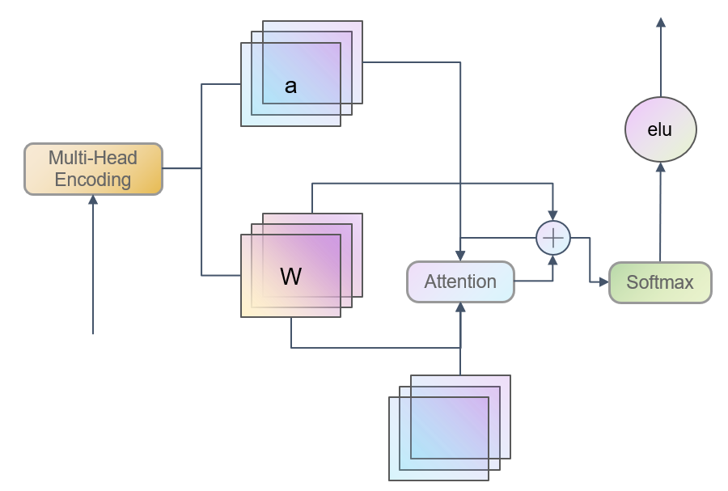

2.  **`MultiScaleGRU` (多尺度门控循环单元)**
    *   **功能**：作为模型的核心时间处理单元。它并行使用多个具有不同循环核尺寸的GRU，以捕捉不同时间尺度上的序列依赖关系。
    *   **优势**：能够同时关注短期的快速变化（如scale=1）和长期的慢速趋势（如scale=5），增强了模型对复杂时间模式的建模能力。

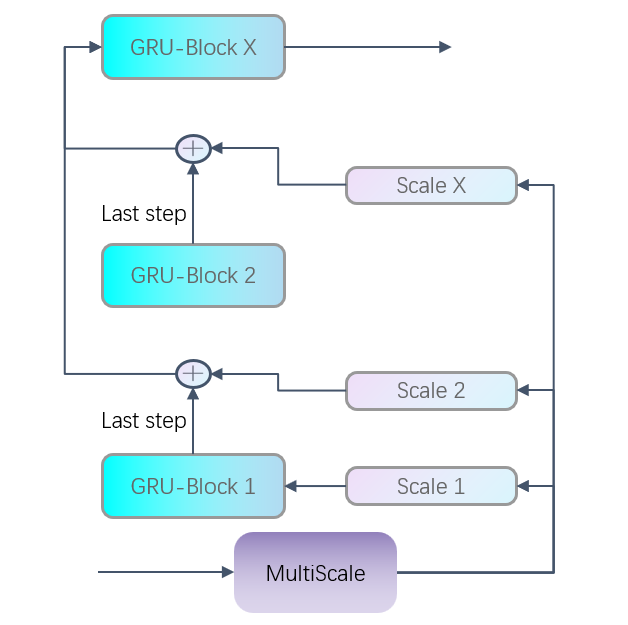

3.  **`SpatioTemporalBlock` (时空模块)**
    *   **功能**：将`TimeAwareGATLayer`和`MultiScaleGRU`有机结合的基础模块。
    *   **流程**：输入的时间序列首先通过`TimeAwareGATLayer`进行空间信息聚合，然后将原始输入和时间特征一同送入`MultiScaleGRU`提取时间序列特征。模块内部包含残差连接（Residual Connection）和层归一化（LayerNorm），以保证信息流的稳定和训练的高效性。

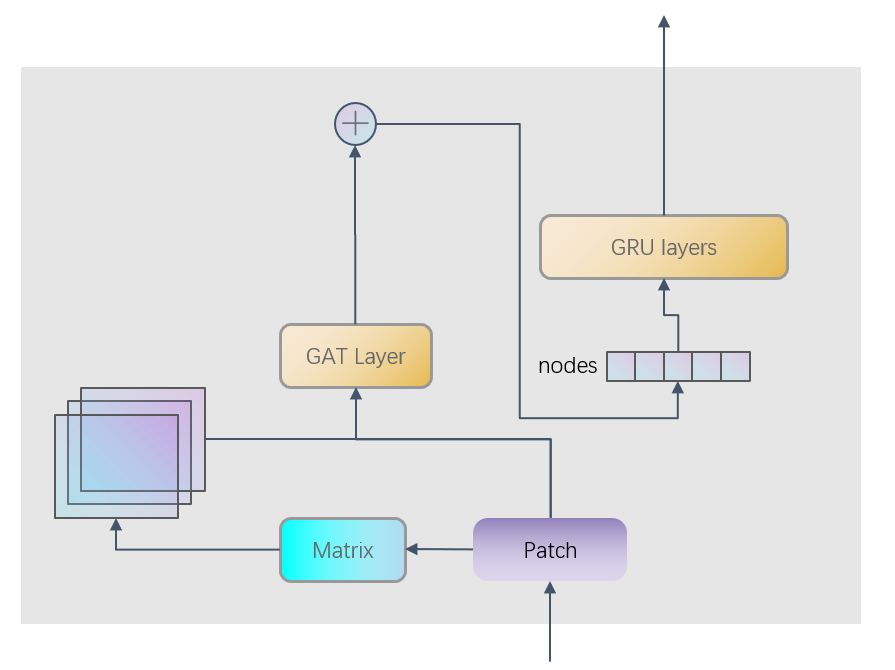

#### **3.2. 整体架构 (`Stacked_GRU_GAT_Predictor_rg`)**

模型整体采用堆叠式设计，以增强表示学习的深度。

1.  **输入处理**：原始的因子序列（如Ratio, Momentum）首先经过一个线性层映射到高维空间。
2.  **时空堆叠**：数据流经多个串联的`SpatioTemporalBlock`。每一层都在前一层的基础上，进一步提炼时空特征。
3.  **自回归预测**：模型引入了一个创新的门控自回归机制。它不仅使用历史数据进行预测，还将模型上一期的预测值作为下一期预测的输入之一。一个可学习的门控参数`lambda`动态地平衡了历史真实值和模型自生成值在预测中的贡献，增强了模型在多步预测中的稳定性和一致性。
4.  **输出层**：最后，通过N个全连接层（MLP）将高维特征解码，使用生成式预测，输出对未来N周`Jd-Ratio`和`Jd-Momentum`的预测值。

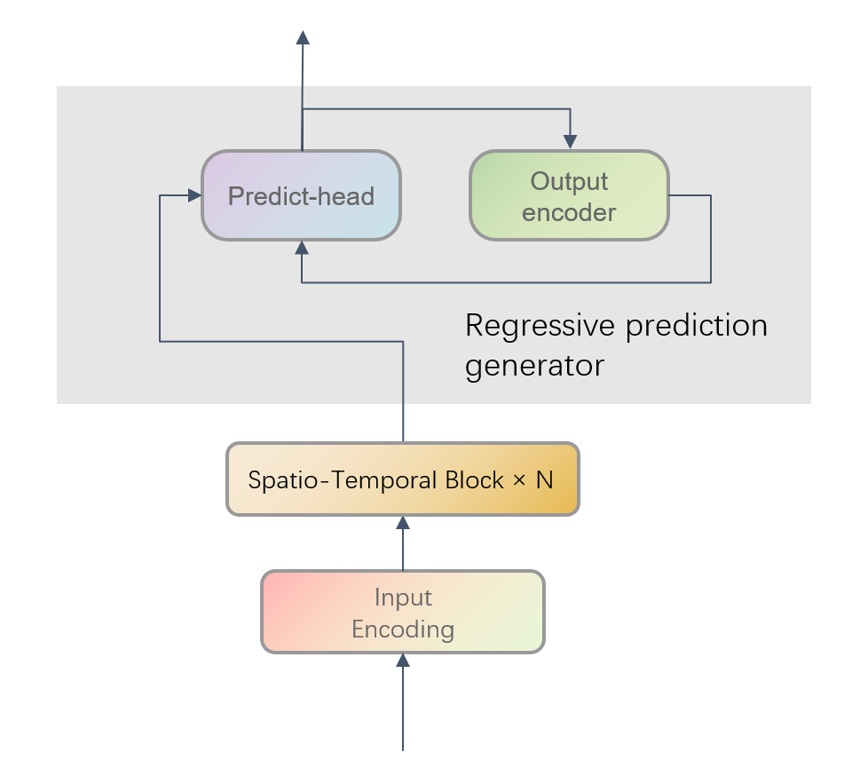

---

### **4. 训练流程 (`train_sw1_rolling.py`)**

为了让模型适应不断变化的市场环境，我们采用了 **滚动训练(Walk-Forward Training)** 的范式，而非一次性训练。

#### **4.1. 滚动机制**

1.  **初始化训练**：使用一个较长的初始历史数据窗口（例如，2010-2025年）对模型进行首次完整训练。
2.  **滚动预测与微调**：
    *   **预测步**：使用当前训练好的模型，向前预测未来一段时间（例如，一个月或一个季度）的因子值。
    *   **数据步进**：将预测过的时间段的数据纳入训练集。
    *   **模型微调（Fine-tuning）**：在更新后的训练集上，对模型进行少量轮次（Epochs）的微调，而不是从头开始训练。
3.  **循环**：重复执行“预测步”和“微调步”，直到所有回测期的数据都被预测完毕。

#### **4.2. 训练细节**

*   **损失函数**：使用均方误差（MSE Loss）作为损失函数，衡量预测因子与真实因子之间的差距。
*   **优化器**：采用AdamW优化器，它在Adam的基础上加入了权重衰减（Weight Decay）的修正，有助于防止过拟合。
*   **学习率调度**：使用`ReduceLROnPlateau`调度器，当验证集损失在一定周期内不再下降时，自动降低学习率，以实现更精细的收敛。

---

### **5. 回测框架与策略 (`backtest_sw1.py`)**

一个可靠的回测框架是检验策略有效性的基石。我们构建的`BackTest`类旨在模拟一个贴近现实的交易过程。

#### **5.1. 交易逻辑**

1.  **执行假设**：策略采用**周五收盘价**进行交易。这意味着，在每周五收盘时，我们根据模型截至当日的最新预测，计算出下周应持有的投资组合，并立即以收盘价完成调仓。
    *   **合理性**：这个假设模拟了在收盘前（如最后30分钟）或利用收盘集合竞价进行交易的真实场景，有效规避了周末的价格跳空风险，是比“下周一开盘价交易”更积极、也更稳健的方案。

2.  **信号生成（下限策略）**：
    *   在每个周五，我们获取模型在上个周五对本周五的`Jd-Ratio`和`Jd-Momentum`的预测值。
    *   **持仓条件 (`combined_condition_leading`)**：策略的核心选股逻辑是寻找“预期进入强势区”的行业。具体条件为：
        *   预测的`Jd-Ratio`在所有行业中排名前列（例如，`rank_start_p`到`rank_end_p`之间）。
        *   预测的`Jd-Ratio`和`Jd-Momentum`的周度变化量也排名前列，且为正数。
    *   这个逻辑旨在筛选出那些不仅预期状态良好，而且预期趋势正在改善的行业。

3.  **投资组合构建**：
    *   将所有满足上述条件的行业筛选出来。
    *   对选中的行业采用 **等权重(Equal Weight)** 分配资金。
    *   如果当周没有任何行业被选中，则**空仓**或持有无风险资产（如债券类ETF）。

#### **5.2. 收益计算与成本**

*   **收益计算**：策略的周度收益由上周五持有的投资组合在本周的周度收益率（基于周五收盘价到下周五收盘价计算）决定。
*   **交易成本**：在回测中，我们设置了买入和卖出费率（例如，`buy_rate=0.003`, `sell_rate=0.003`）。每次调仓时，换手部分的市值会按比例扣除成本，直接反映在策略的净值曲线上。

#### **5.3. 绩效评估**

回测结束后，系统会生成一系列详细的绩效指标，包括：

*   **收益指标**：累计收益、年化收益、超额收益。
*   **风险指标**：年化波动率、最大回撤、Beta。
*   **风险调整后收益**：夏普比率、卡尔玛比率、索提诺比率、Alpha、信息比率。
*   **交易行为指标**：年化换手率、总交易成本、成本对收益影响分析。

这些指标共同构成了一个对策略全方位的立体评估。

---

### **6. 实验结果与分析**

本节展示了基于上述时空图神经网络行业轮动策略的回测实验结果。所有结果均基于申万一级行业指数历史数据，采用滚动训练与真实交易成本假设，评估策略在不同参数组合下的表现。

#### **6.1. 回测参数设置**

- 回测区间：2019年05月 ~ 2025年11月
- 预测步长：1, 2, 3周
- 隐藏层规模（hidden_size）：100, 128, 200, 256, 320, 360, 512 等
- 交易成本：买入费率 0.3%，卖出费率 0.3%
- 基准指数：沪深300（000300.SH）
- 无风险资产：国债ETF（511010.SH）

#### **6.2.策略组件解析**

轮动策略主要由两个核心部分构成：**基于预测的动量策略** 和 **基于历史的动量策略**。两者逻辑相似，区别仅在于使用的数据源不同。

1. **基于模型预测的“领先”策略 (Prediction-Based "Leading" Strategy)**

    - 该条件完全依赖于模型预测出的未来RRG指标值（`x_pred` 和 `y_pred`，即 `ratio_df` 和 `momentum_df`）。
    - 在 `prev_date` 这一天，根据模型对未来的预测，找出具备最强“领先”潜力的板块。

    **总结**：选出那些模型预测其“RRG指标强度”、“动量加速度”和“相对强度加速度”三者都将处于市场顶尖水平的板块。这是一个非常苛刻的、旨在捕捉最强爆发力的领先信号。

---

2. **基于历史数据的“滞后”策略 (Lagging/Historical Strategy)**

    - 该条件与基于预测的动量策略结构完全一样，但不使用任何模型预测数据，而是完全依赖于已经发生的历史RRG指标值（`ratio_w_df` 和 `momentum_w_df`）。
    - 代表了一种经典的、基于过去表现的动量跟随策略。

    **总结**：选出那些在过去一段时间里，其“历史RRG指标强度”、“历史动量加速度”和“历史相对强度加速度”三者都已经处于市场顶尖水平的板块。这是一个确认性的、旨在捕捉已经形成趋势的滞后信号。

---

##### 策略参数定义

1. **因子定义**

    - **RS动量（ratio/rs）**  
    传统的一阶动量，通常指资产的收益率、涨幅或相对强弱指标（Relative Strength）。反映某个行业或股票在近期的相对基准的强度。

    - **二阶动量（momentum, rs_diff）**  
    动量的变化率，即一阶动量的“加速度”。衡量动量本身的提升或减弱趋势，反映行业或股票的趋势变化。

    - **三阶动量（momentum_diff）**  
    二阶动量的变化率，即二阶动量的“加速度”。衡量二阶动量本身的提升或减弱趋势，缩短了RRG双因子与实际指数的变化滞后区间。

---

2. **策略筛选逻辑**

    - **第一步：RS动量筛选**  
    对所有行业/股票，计算RS动量，并排序。选取排名靠前的资产（如第1~20名），认为这些是近期表现最强的。

    - **第二步：二阶动量筛选**  
    计算RS动量的变化（即二阶动量），并排序。选取变化最大的资产（如前15名），要求变化值大于等于1，代表这些资产的强势正在加速。

    - **第三步：三阶动量筛选**  
    计算RS二阶动量的变化（即三阶动量），并排序。选取变化最大的资产（如前10名），要求变化值大于等于1，代表这些资产的二阶加速度处于领先区间。

    - **第四步：交集筛选**  
    只有同时满足“RS动量排名靠前”和“二阶&三阶动量变化显著”的资产，才会被选入最终投资组合。这保证了选出的资产既强势又趋势改善明显。

    > 通过 `rank_start`、`rank_end`、`rank_diff_r`、`rank_diff_m` 等参数灵活调整筛选范围和风格。  
    > 例如，`rank_start=1, rank_end=20` 表示选取RS动量前1-20名，`rank_diff_r=15, rank_diff_m=10` 表示选取二阶/三阶动量最大的15个和10个资产。

---

3. **组合构建与持仓**

    - 对筛选出的资产进行等权分配，构建本期投资组合。
    - 如果没有资产满足条件，则全部资金配置到备选资产（如债券）。

#### **6.3. 主要绩效指标**

通过调整策略参数以及模型参数，统计了各组合对应的回测收益，包括年化收益率，夏普比率，换手率（交易成本）等

##### 策略参数组合1

| 策略名称         | 年化收益-策略 | 年化超额收益 | 年化波动-策略 | 夏普比率-策略 | 最大回撤-策略 | Alpha   | Beta    | 交易成本对收益影响 | 年化换手率 |
|------------------|---------------|--------------|---------------|---------------|---------------|---------|---------|-------------------|------------|
| stack_rg_1_100   | 13.75%        | 11.27%       | 14.58%        | 0.9431        | -10.16%       | 0.1170  | 0.1102  | 25.41%            | 1148.78%   |
| stack_rg_1_128   | 16.82%        | 14.33%       | 15.21%        | 1.1056        | -9.04%        | 0.1474  | 0.1564  | 21.30%            | 1215.65%   |
| stack_rg_1_200   | 14.15%        | 11.67%       | 14.19%        | 0.9977        | -11.43%       | 0.1210  | 0.1157  | 21.70%            | 972.11%    |
| stack_rg_1_256   | 8.05%         | 5.57%        | 13.01%        | 0.6190        | -10.21%       | 0.0600  | 0.1030  | 39.26%            | 1087.83%   |
| stack_rg_1_360   | 10.78%        | 8.29%        | 12.51%        | 0.8617        | -10.39%       | 0.0874  | 0.0789  | 23.67%            | 753.51%    |
| stack_rg_2_128   | 9.16%         | 6.68%        | 16.05%        | 0.5710        | -25.18%       | 0.0706  | 0.2068  | 38.09%            | 1215.13%   |
| stack_rg_2_200   | 7.01%         | 4.52%        | 14.28%        | 0.4906        | -14.05%       | 0.0493  | 0.1562  | 46.36%            | 1229.28%   |
| stack_rg_2_256   | 8.62%         | 6.13%        | 14.88%        | 0.5790        | -15.09%       | 0.0654  | 0.1490  | 38.23%            | 1132.07%   |
| stack_rg_2_360   | 6.65%         | 4.16%        | 12.94%        | 0.5138        | -15.27%       | 0.0462  | 0.0645  | 41.06%            | 930.96%    |
| stack_rg_3_256   | 10.28%        | 7.80%        | 15.76%        | 0.6524        | -11.62%       | 0.0817  | 0.2269  | 34.62%            | 1211.28%   |
| stack_rg_3_320   | 8.56%         | 6.07%        | 14.58%        | 0.5870        | -9.63%        | 0.0647  | 0.1873  | 39.58%            | 1188.13%   |
| stack_rg_3_360   | 2.56%         | 0.08%        | 13.05%        | 0.1966        | -11.77%       | 0.0051  | 0.1055  | 65.91%            | 889.81%    |
| stack_rg_3_512   | 0.75%         | -1.74%       | 11.76%        | 0.0635        | -16.16%       | -0.0129 | 0.0679  | 88.90%            | 1020.97%   |

---

##### 策略参数组合2

| 策略名称         | 年化收益-策略 | 年化超额收益 | 年化波动-策略 | 夏普比率-策略 | 最大回撤-策略 | Alpha   | Beta    | 交易成本对收益影响 | 年化换手率 |
|------------------|---------------|--------------|---------------|---------------|---------------|---------|---------|-------------------|------------|
| stack_rg_1_100   | 8.85%         | 6.36%        | 13.44%        | 0.6581        | -13.62%       | 0.0681  | 0.0782  | 31.94%            | 887.24%    |
| stack_rg_1_128   | 11.64%        | 9.15%        | 13.27%        | 0.8770        | -12.65%       | 0.0958  | 0.1248  | 22.98%            | 802.37%    |
| stack_rg_1_200   | 11.32%        | 8.84%        | 13.53%        | 0.8366        | -8.80%        | 0.0928  | 0.0820  | 23.61%            | 801.09%    |
| stack_rg_1_256   | 8.27%         | 6.78%        | 13.00%        | 0.6362        | -8.80%        | 0.0631  | 0.0816  | 33.43%            | 865.34%    |
| stack_rg_1_360   | 10.86%        | 8.37%        | 11.79%        | 0.9212        | -12.46%       | 0.0883  | 0.0691  | 17.40%            | 516.91%    |
| stack_rg_2_128   | 3.97%         | 1.49%        | 14.30%        | 0.2777        | -24.36%       | 0.0190  | 0.1463  | 55.45%            | 921.96%    |
| stack_rg_2_200   | 5.68%         | 3.19%        | 13.96%        | 0.4066        | -11.76%       | 0.0362  | 0.1193  | 49.64%            | 1094.26%   |
| stack_rg_2_256   | 8.76%         | 6.27%        | 13.76%        | 0.6362        | -13.30%       | 0.0671  | 0.1072  | 34.80%            | 996.28%    |
| stack_rg_2_360   | 5.74%         | 3.26%        | 11.79%        | 0.4872        | -13.64%       | 0.0372  | 0.0480  | 41.74%            | 806.23%    |
| stack_rg_3_256   | 8.82%         | 6.34%        | 14.63%        | 0.6032        | -11.62%       | 0.0673  | 0.1839  | 33.85%            | 964.39%    |
| stack_rg_3_320   | 10.09%        | 7.61%        | 13.49%        | 0.7483        | -9.87%        | 0.0802  | 0.1482  | 30.00%            | 956.68%    |
| stack_rg_3_360   | 4.09%         | 1.61%        | 12.13%        | 0.3377        | -10.59%       | 0.0206  | 0.0786  | 51.46%            | 812.66%    |
| stack_rg_3_512   | 1.05%         | -1.44%       | 9.50%         | 0.1100        | -21.33%       | -0.0097 | 0.0242  | 81.45%            | 789.52%    |

---

##### 策略参数组合3

| 策略名称         | 年化收益-策略 | 年化超额收益 | 年化波动-策略 | 夏普比率-策略 | 最大回撤-策略 | Alpha   | Beta    | 交易成本对收益影响 | 年化换手率 |
|------------------|---------------|--------------|---------------|---------------|---------------|---------|---------|-------------------|------------|
| stack_rg_1_100   | 5.70%         | 3.22%        | 11.19%        | 0.5097        | -9.08%        | 0.0368  | 0.0451  | 26.19%            | 396.04%    |
| stack_rg_1_128   | 8.74%         | 6.25%        | 11.66%        | 0.7496        | -9.08%        | 0.0670  | 0.0800  | 16.40%            | 365.18%    |
| stack_rg_1_200   | 5.42%         | 2.94%        | 9.97%         | 0.5440        | -8.95%        | 0.0340  | 0.0372  | 20.41%            | 270.03%    |
| stack_rg_1_256   | 5.23%         | 2.74%        | 10.17%        | 0.5142        | -8.26%        | 0.0321  | 0.0409  | 21.09%            | 270.03%    |
| stack_rg_1_360   | 8.87%         | 6.39%        | 9.23%         | 0.9618        | -4.10%        | 0.0686  | 0.0213  | 7.17%             | 146.59%    |
| stack_rg_2_128   | 5.58%         | 3.09%        | 10.87%        | 0.5135        | -8.68%        | 0.0354  | 0.0760  | 29.84%            | 462.91%    |
| stack_rg_2_200   | 4.94%         | 2.45%        | 10.81%        | 0.4569        | -9.72%        | 0.0289  | 0.1050  | 28.13%            | 370.33%    |
| stack_rg_2_256   | 6.13%         | 3.64%        | 10.48%        | 0.5848        | -8.26%        | 0.0408  | 0.0885  | 25.91%            | 424.33%    |
| stack_rg_2_360   | 3.79%         | 1.30%        | 9.69%         | 0.3908        | -9.43%        | 0.0176  | 0.0445  | 32.07%            | 331.75%    |
| stack_rg_3_256   | 0.67%         | -1.82%       | 11.53%        | 0.0580        | -11.23%       | -0.0140 | 0.1313  | 80.78%            | 478.34%    |
| stack_rg_3_320   | 3.65%         | 1.16%        | 10.38%        | 0.3518        | -8.53%        | 0.0160  | 0.1128  | 31.91%            | 316.32%    |
| stack_rg_3_360   | 2.68%         | 0.19%        | 9.72%         | 0.2758        | -9.52%        | 0.0065  | 0.0549  | 38.41%            | 300.89%    |
| stack_rg_3_512   | 5.81%         | 3.32%        | 5.89%         | 0.9858        | -8.00%        | 0.0381  | -0.0078 | 21.72%            | 316.32%    |

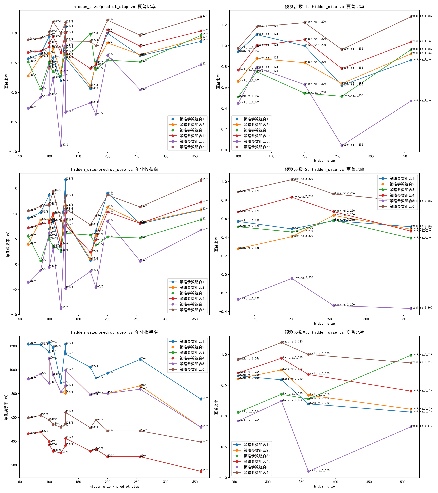

---

#### **6.4. 策略净值曲线与持仓信号**

#### 策略可行性验证

- 为了验证策略在回测期外（如2008至2018年）依旧具有正向收益，使用实际数据与基准策略，在无风险资产持有/空仓条件下，分别得到的净值曲线如下：

##### 基准策略参数组合1

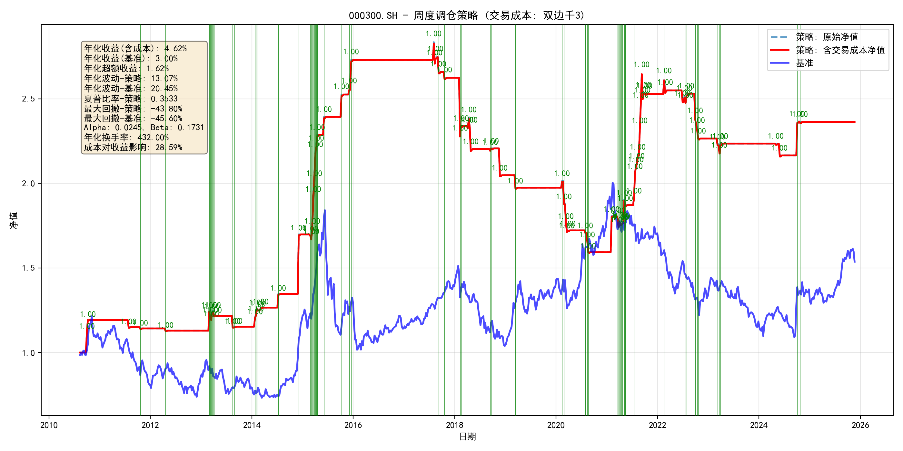
rank_start= 1
rank_end = 20
rank_diff_r = 15
rank_diff_m = 10

---

##### 基准策略参数组合2
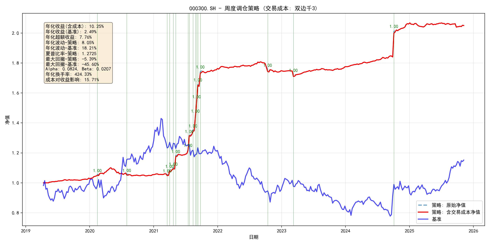
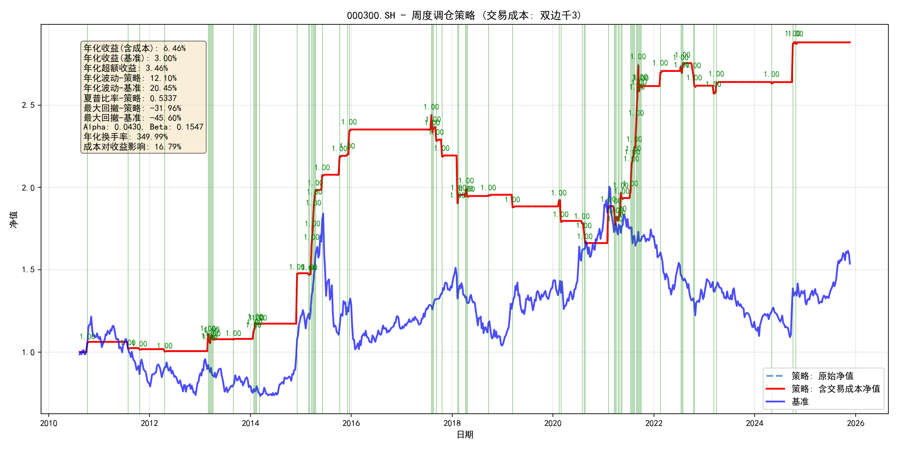
rank_start= 1
rank_end = 15
rank_diff_r = 15
rank_diff_m = 10

---

##### 基准策略参数组合3

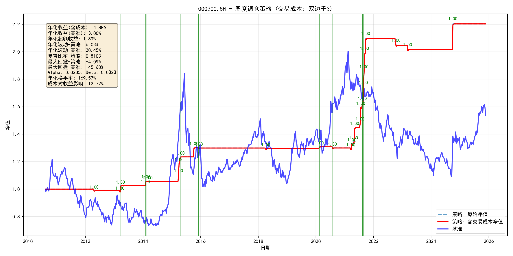
rank_start= 5
rank_end = 15
rank_diff_r = 15
rank_diff_m = 10

---

#### 多模型回测结果

- 在回测期内（2019-2025），使用各模型使用滚动训练/预测得到的结果，进行策略回测，在各参数组合与模型组合下，得到净值曲线如下：

其中，绿色垂直线代表持仓信号，并标注了多模型信号聚合度(0至1)表示此次持仓信号在模型组合中的同意度

---

##### 模型策略参数组合1

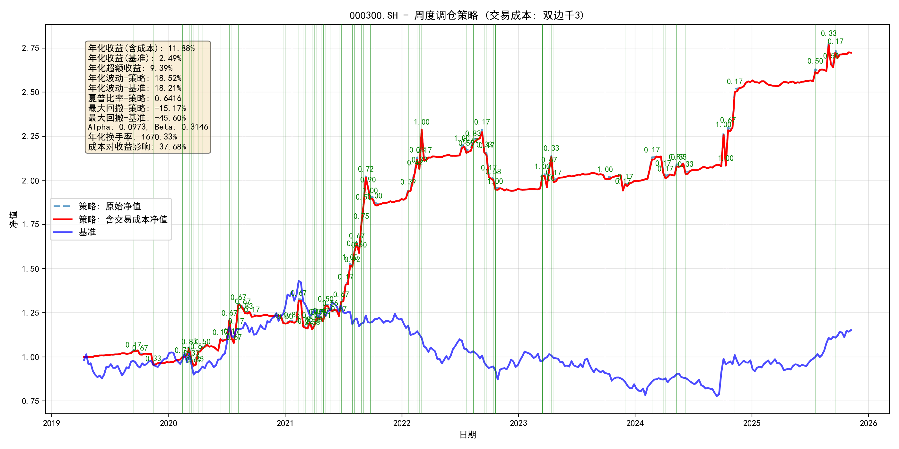

test_buckets = [(1,100),(1,128),(1,200),(2,128),(2,256),(3,256)]

rank_start= 1
rank_end = 20
rank_diff_r = 15
rank_diff_m = 10

---

##### 模型策略参数组合2

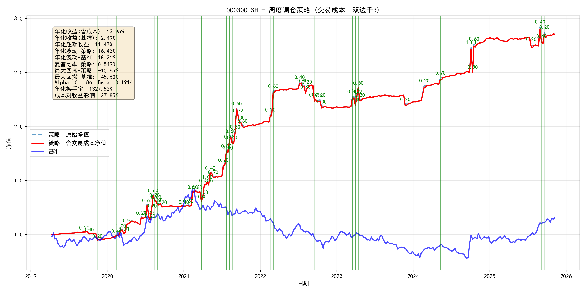

test_buckets = [(1,128),(1,200),(1,360),(2,256),(3,320)]

rank_start= 1
rank_end = 15
rank_diff_r = 15
rank_diff_m = 10

---

##### 模型策略参数组合3

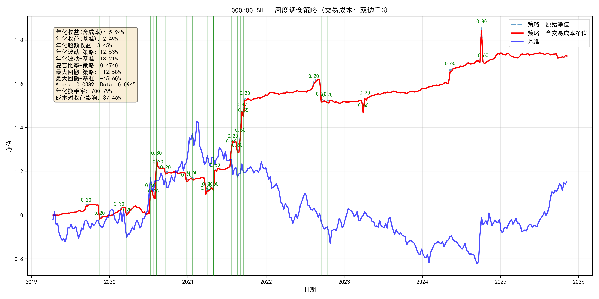

test_buckets = [(1,128),(1,360),(2,128),(2,256),(3,512)]

rank_start= 5
rank_end = 15
rank_diff_r = 15
rank_diff_m = 10

#### **6.5. 因子有效性与市场特征分析**

**TV-PR分析法详解**

1. **方法简介**

TV-PR（Time-Varying Parameter Regression，时变参数回归）是一种用于量化金融因子有效性分析的统计方法。它通过在滚动时间窗口内动态估计因子收益（Beta），揭示因子在不同市场环境下的表现变化。TV-PR能够捕捉因子权重的时序波动，避免静态回归模型的前视偏差和过拟合问题，是多因子策略研究中的重要工具。

2. **数学原理**

TV-PR的核心思想是在每个时间窗口内，利用横截面回归拟合未来收益与因子暴露的关系，并对因子权重（Beta）施加时序平滑和稀疏约束。具体优化目标如下：

$$
\min_{\beta_{t}} \sum_{i=1}^{T} \|Y_i - X_i \beta_i\|^2 + \lambda_1 \sum_{i=1}^{T} |\beta_i| + \lambda_2 \sum_{i=2}^{T} |\beta_i - \beta_{i-1}|
$$

其中：

- $Y_i$：第$i$期所有资产的未来收益（如一周后涨跌幅）
- $X_i$：第$i$期所有资产的因子暴露矩阵
- $\beta_i$：第$i$期的因子权重（待估参数）
- $\lambda_1$：Lasso稀疏正则化参数，控制因子选择
- $\lambda_2$：时序平滑正则化参数，控制因子权重变化的平滑性

通过上述优化，TV-PR能够在每个时间点动态调整因子权重，反映市场结构和因子有效性的变化。

---

**分析结果**

- 因子暴露随时间变化的可视化结果如下图所示：

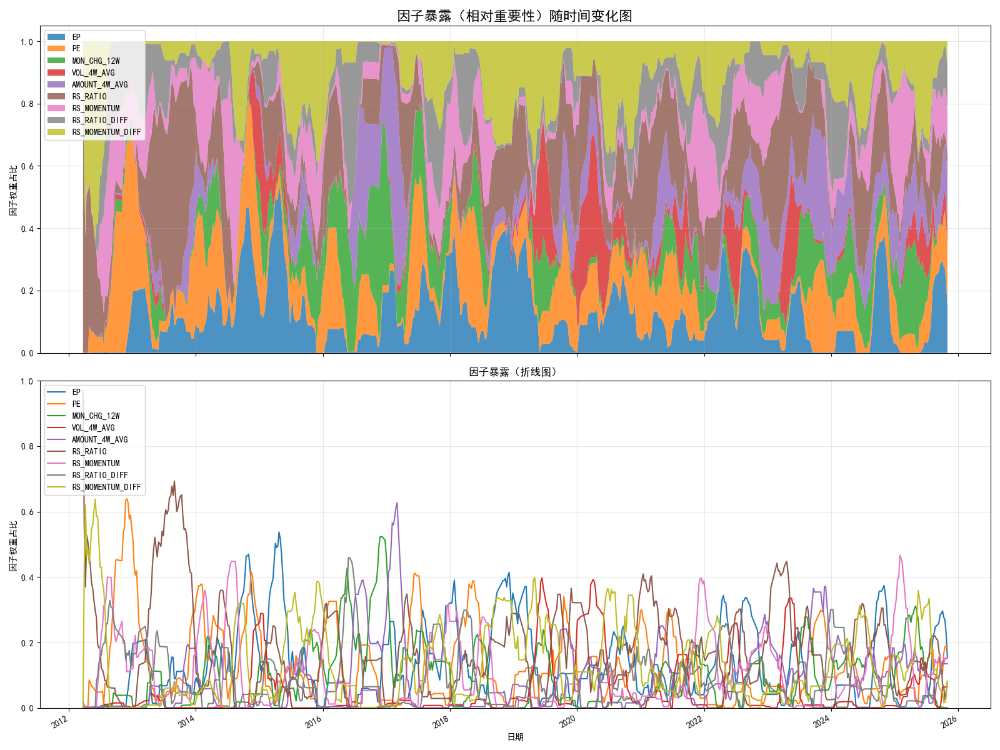

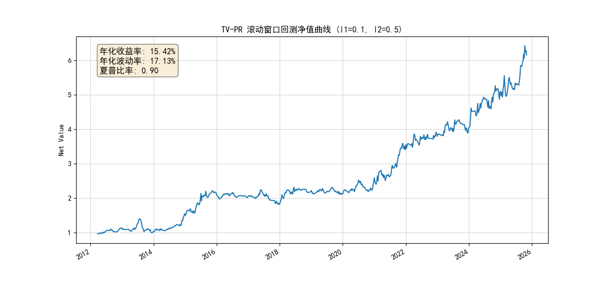

上图展示了各因子在回测期间的归一化暴露比例。可以观察到，不同因子在市场不同阶段的主导性存在显著变化，反映了行业轮动过程中因子驱动的动态特征, 但rrg代表的RS动量因子以及由其衍生计算得出的1-3阶动量在不同市场特征内都具有有效的因子暴露值.

#### **6.6. 结果讨论**

- 策略在不同市场环境下的稳定性
- 交易成本对收益的影响
- 行业轮动信号的可解释性与实用性

---

*注：具体实验数据与图表请见后续补充。*

### **7. 结论与展望**

本项目完整地实现了从数据处理、模型构建、滚动训练到策略回测的全链路量化研究流程。通过引入先进的时空图神经网络模型，我们尝试从更高维度理解并预测行业轮动。

初步的回测结果表明，在考虑了现实的交易约束和成本后，本策略展现了获取超额收益的潜力。

**未来可行的改进方向包括：**

1.  **丰富因子维度**：在现有RRG因子的基础上，引入更多宏观、估值、资金流、拥挤度等因子，为模型提供更全面的信息。
2.  **优化策略逻辑**：探索更复杂的投资组合优化方法（如最小方差、风险平价），替代当前的等权重方案。
3.  **改进模型结构**：尝试更先进的图网络结构，或将Transformer等注意力机制融入到时间序列处理中。
4.  **多频率融合**：研究如何将日线级别的高频信号与周线级别的趋势信号进行有效融合。

---